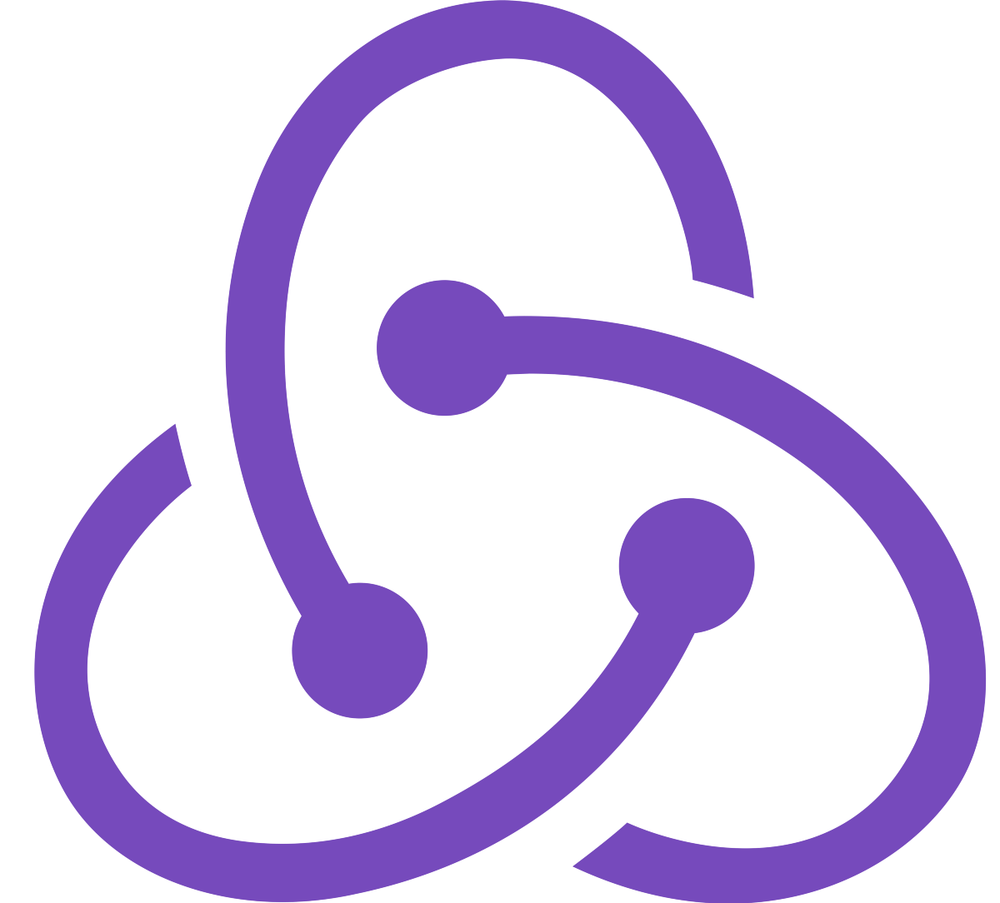

<h1 align="center"> Hola 👋🏽, Yo soy Francisco, Bienvenido/a</h1>

<h3 align="center">
   Sobre mí
</h3>

👀 ¿Quién soy?  
🔹 Desarrollador FullStack, con la capacidad de desarrollar páginas y aplicaciones web, escalables, modularizadas y optimizadas. ⏱
 
 
🤔 ¿Por qué yo?  
🔸 Más allá de los conocimientos técnicos, soy una persona curiosa, que le encanta aprender y enseñar. 
Me considero una persona detallista, pragmática, proactiva y con buena comunicación. 📣
 
 
🤓 ¿Mi Background?  
✔ Complete 2 años y medio, de la carrera Ingenieria Industrial en la UBA(Universidad de Buenos Aires),en el cual aprendi a a resolver problemas de manera eficiente, capacidad crítica y tener un pensamiento analítico. 
  
✔ Ingresé al Bootcamp soyHenry donde, además de profundizar en las distintas tecnologías, aprendí metodologías agiles, a trabajar en conjunto con otros desarrolladores y comunicarme con profesionales que no sean del rubro IT. 👥
  
✔ Actualmente me encuentro listo para mi primera experiencia laboral en el mundo IT! 😁
 
  🖥 Mis Proyectos 
 
   Falta Uno!
 
    
   FaltaUno! Es una App para el alquiler de canchas y elementos deportivos de diferentes complejos. Cuenta con funcionalidades como: login, paserala de pago, chat interno, calendario y notificaciones, entre otras. Mi trabajo en la app estuvo enfocado en todo lo relacionado con las vistas y funcionalidades de los dueños de canchas, y el panel del administrador.
    
    
🖥 <a href="https://falta-uno-henry.vercel.app/">Link al proyecto</a>
   
 
 

   
    

 

  
   Healthier
 
    
   FaltaUno! Es una App para el alquiler de canchas y elementos deportivos de diferentes complejos. Cuenta con funcionalidades como: login, paserala de pago, chat interno, calendario y notificaciones, entre otras. Mi trabajo en la app estuvo enfocado en todo lo relacionado con las vistas y funcionalidades de los dueños de canchas, y el panel del administrador.
    
    
🖥 <a href="https://falta-uno-henry.vercel.app/">Link al proyecto</a>
   
 
 

   
    

 

 
🔔 ¿Creés que soy lo que tu equipo está buscando? No dudes en contactarme. 
 
📤 Email: franciscofuhr00@gmail.com
<!--  
💼 <a href=">Mi Portafolio</a> -->
 
👥 <a href="https://www.linkedin.com/in/franciscofuhrdev/">Mi LinkedIn</a>
 

<h2 align="center">
    Tecnologías con las que trabajo:
</h2>

   
   
   
   
   
   
   
   

   
   
   
   
   

  

<!-- <h2 align="center">
    Mis contribuciones:
</h2>

   -->

 
 

  &nbsp; &nbsp;
  

